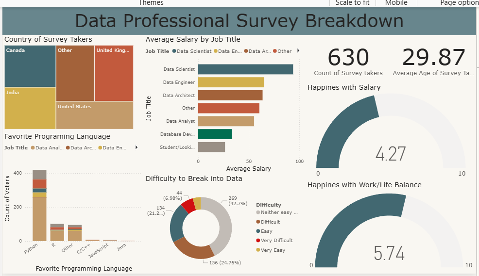

# 📊 Power BI Dashboard - Data Professional Survey Breakdown

This dashboard was built using **Microsoft Power BI** to analyze survey results from professionals working in data-related roles.  
The visualization provides insights into demographics, salaries, job satisfaction, and preferred programming languages among data professionals worldwide.

---

## 🎯 Project Objective

The purpose of this project is to:
- Practice **data analysis and visualization** using Power BI.  
- Understand factors that influence job satisfaction in the data field.  
- Analyze salary levels, programming language preferences, and challenges in entering data-related careers.

---

## 📊 Dashboard Features

1. **Country of Survey Takers**  
   Displays the geographic distribution of respondents using a treemap.

2. **Average Salary by Job Title**  
   Compares average salaries across different data-related job roles.

3. **Favorite Programming Language**  
   Shows the most popular programming languages among data professionals.

4. **Difficulty to Break into Data**  
   Visualizes how difficult respondents found it to enter the data field.

5. **Happiness Metrics**  
   - *Happiness with Salary*  
   - *Happiness with Work/Life Balance*  

   Presented using gauge charts to show average happiness levels on a 0–10 scale.

---

## 📸 Dashboard Preview

---

## ⚙️ Tools & Technologies Used

| Tool / Software | Purpose |
|------------------:|:---------|
| **Microsoft Power BI** | To build and design the dashboard |
| **Power Query Editor** | To clean and transform data |
| **Excel Dataset** | Source file for analysis |

---

## 📈 Key Insights

From the analysis:
- **Python** is the most popular programming language among data professionals.  
- **Data Scientists** earn the highest average salaries among all roles.  
- A significant portion of respondents found it **challenging to enter the data field**, yet reported relatively **high satisfaction levels** overall.  
- The **average happiness with work/life balance** is slightly higher than happiness with salary.

Additional visualizations and details can be explored interactively within the Power BI dashboard, allowing users to filter data by job title, country, or other attributes for deeper insights.

---

## 🧭 How to Use

To explore and interact with the dashboard, follow these steps:

1. **Download the Power BI file**  
   Click on `Data_Professional_Survey_Breakdown.pbix` in this repository and download it to your computer.

2. **Open the file in Microsoft Power BI Desktop**  
   - If you don’t have Power BI Desktop installed, you can download it for free from the [Microsoft Power BI website](https://powerbi.microsoft.com/desktop/).  
   - Once opened, the dashboard will automatically load all visuals and data.

3. **Explore the dashboard interactively**  
   - Hover over visuals to view detailed tooltips.  
   - Use filters and slicers to analyze data by country, job title, or other attributes.  
   - Switch between different visualizations to gain deeper insights about salary, happiness, and work-life balance.

💡 *This dashboard is fully interactive — users can filter data dynamically and explore multiple perspectives on the survey results.*

---

## 🧠 What I Learned

Through this project, I practiced:
- Data storytelling and visual communication.  
- Building clear, professional dashboards in Power BI.  
- Using Power Query to clean, transform, and analyze data.  
- Presenting data insights for data-related career analysis.

💡 *This project is part of my Data Analyst portfolio and serves as a demonstration of Power BI data visualization skills.*
